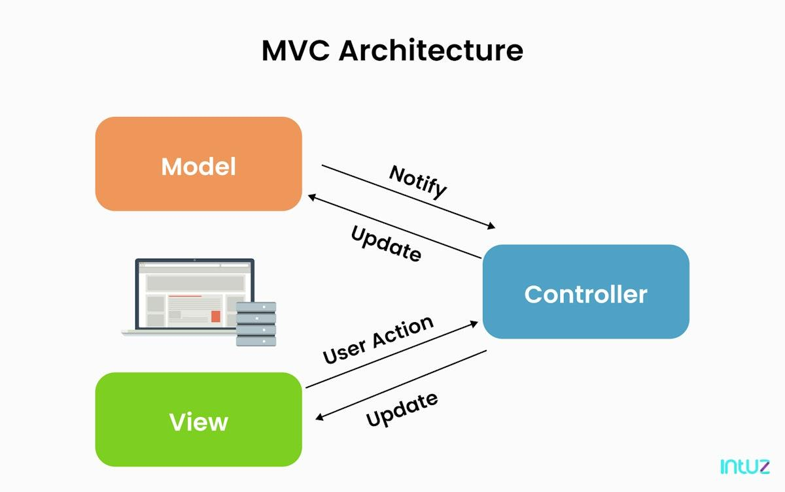
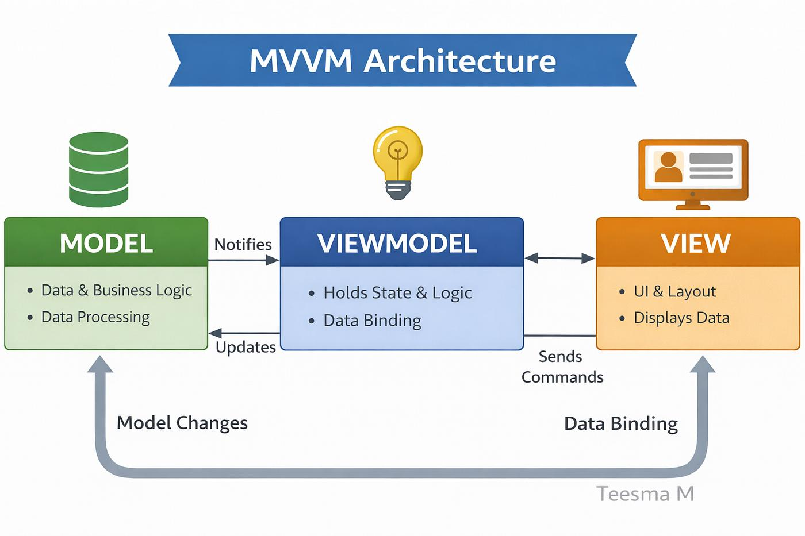
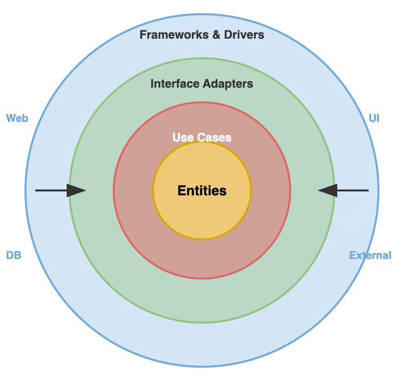
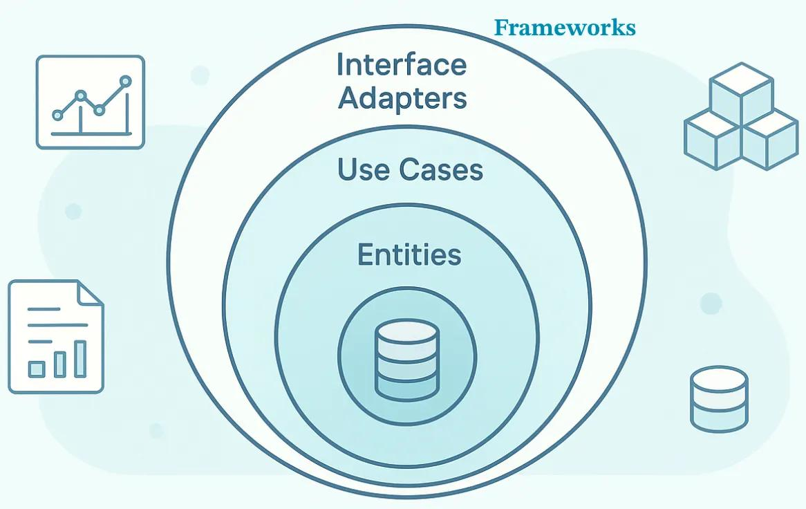
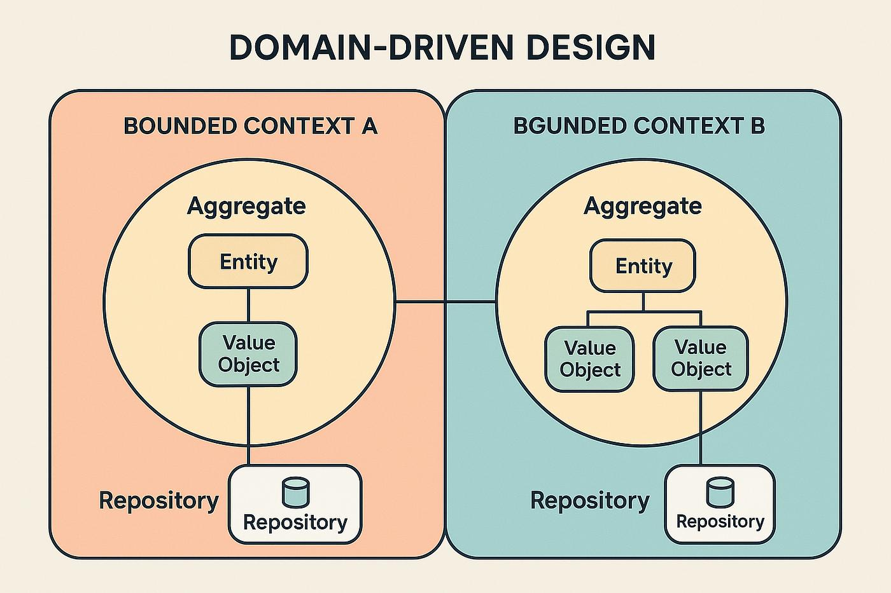

# Các loại Layered Architecture
Dĩ nhiên. Hãy xem 4 kiến trúc này như một quá trình tiến hóa từ đơn giản → chuyên nghiệp.

### 1\. MVC – Model View Controller

### Ý tưởng

Tách ứng dụng thành 3 phần:

*   Model → dữ liệu + logic.
*   View → giao diện hiển thị.
*   Controller → nhận sự kiện và điều khiển.

### Luồng hoạt động

Userclicks

Controllerhandles

Modeldata

Viewrenders

### Ưu điểm

*   Dễ hiểu.
*   Phù hợp ứng dụng nhỏ và vừa.
*   Học nhanh.

### Nhược điểm

*   Controller thường phình to.
*   Khó mở rộng dự án lớn.
*   UI và logic vẫn còn phụ thuộc nhau khá nhiều.

### Ví dụ PySide6

### 2\. MVVM – Model View ViewModel

### Ý tưởng

Được tạo ra để giải quyết vấn đề của MVC trong ứng dụng giao diện hiện đại.

*   Model → dữ liệu.
*   View → giao diện.
*   ViewModel → logic hiển thị cho View.

### Điểm đặc biệt

View không gọi Model trực tiếp.

Mọi thứ đi qua ViewModel.

### Luồng

ViewUI

ViewModelpresentation logic

Modeldata

Data Binding (tự động đồng bộ dữ liệu)

### Ưu điểm

*   UI sạch hơn.
*   Dễ test.
*   Rất hợp với Qt/QML, WPF, Flutter.
*   Hỗ trợ data binding.

### Nhược điểm

*   Khó hiểu hơn MVC.
*   Cần cơ chế binding.
*   Dễ tạo quá nhiều ViewModel.

### PySide6 thường dùng khi nào?

Khi ứng dụng có:

*   Nhiều màn hình.
*   Dữ liệu thay đổi liên tục.
*   Dashboard.
*   Bảng thống kê.
*   Realtime update.

### 3\. Clean Architecture

### Ý tưởng cốt lõi

Business logic phải độc lập với framework.

Thay PySide6 bằng Web, thay SQLite bằng PostgreSQL mà nghiệp vụ gần như không đổi.

### Các lớp

### Ví dụ hệ thống truyện

*   Entities → Story, Chapter.
*   Use Cases → CrawlStory, DownloadChapter.
*   Interface Adapters → Repository, Controller.
*   Frameworks → PySide6, SQLite, requests.

### Ưu điểm

*   Rất dễ bảo trì.
*   Dễ test.
*   Dễ thay công nghệ.
*   Phù hợp dự án lớn.

### Nhược điểm

*   Nhiều file.
*   Nhiều interface.
*   Hơi “quá tay” cho dự án nhỏ.

### 4\. Domain-Driven Design (DDD)

### Ý tưởng

Không bắt đầu từ database.

Bắt đầu từ nghiệp vụ thực tế.

### Ví dụ hệ thống truyện

Ta không nghĩ:

Bảng story có cột gì?

Ta nghĩ:

Một truyện có vòng đời như thế nào?

Domain gồm:

*   Story
*   Chapter
*   CrawlTask
*   DownloadJob
*   ReaderProgress
*   SourcePlugin

### Khái niệm quan trọng

| Khái niệm | Ý nghĩa |
| --- | --- |
| Entity | Đối tượng có ID |
| Value Object | Đối tượng không cần ID |
| Aggregate | Nhóm entity liên quan |
| Repository | Truy cập dữ liệu |
| Domain Service | Logic nghiệp vụ phức tạp |
| Bounded Context | Ranh giới nghiệp vụ |

### Ưu điểm

*   Rất mạnh cho hệ thống lớn.
*   Phản ánh đúng nghiệp vụ.
*   Team nhiều người làm việc dễ hơn.
*   Dễ mở rộng lâu dài.

### Nhược điểm

*   Khó học.
*   Nhiều khái niệm.
*   Cần hiểu nghiệp vụ sâu.
*   Không phù hợp app nhỏ.

### So sánh nhanh

| Kiến trúc | Độ khó | Quy mô | Phù hợp |
| --- | --- | --- | --- |
| MVC | ⭐ | Nhỏ | Học cơ bản |
| MVVM | ⭐⭐ | Nhỏ–vừa | Ứng dụng GUI |
| Clean | ⭐⭐⭐ | Vừa–lớn | Backend, desktop |
| DDD | ⭐⭐⭐⭐⭐ | Lớn | Hệ thống doanh nghiệp |

### Với dự án của bạn nên chọn gì?

### Khởi đầu

3 tầng + Repository Pattern

### Khi UI lớn hơn

MVVM

### Khi có nhiều plugin cào

Clean Architecture

### Khi hệ thống thành sản phẩm thật

DDD + Clean Architecture

### Lộ trình học thực tế cho bạn

1

3-Tier Architecture

Bạn đang học bước này

2

Repository Pattern

Tách SQLite khỏi logic

3

Service Layer

Nghiệp vụ cào truyện

4

MVVM với PySide6

UI chuyên nghiệp

5

Clean Architecture

Tách framework

6

DDD

Khi hệ thống rất lớn

Với mục tiêu hiện tại (PySide6 + SQLite3 + hệ thống cào truyện), mình khuyên:

### Kiến trúc tối ưu cho giai đoạn này

### 3 tầng + Repository + Service Layer

### MVVM cho phần giao diện PySide6

### Dần dần chuyển sang Clean Architecture

Đây là con đường mà rất nhiều ứng dụng desktop Python chuyên nghiệp đi theo.